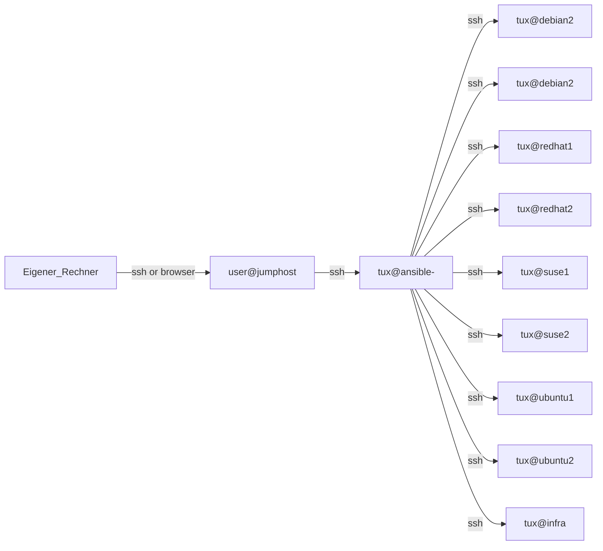

# setup


## Setup für die Schulung
Alle TN haben eine eigene Umgebung mit einem eigenen Ansible-Controller-System `ansible-<X>`. Das `<X>` steht für die eigene Usernummer. In der Umgebung stehen insgesamt 8 VMs als Zielsysteme zur Verfügung.



### Einloggen über das CLI auf dem Jumphost (vorzugsweise)
1. `ssh userX@94360.training.b1-systems.de`, 
    PW aus den Zugangsdaten hier, für das `X` im Folgenden ist immer die eigene User-Nummer einzugeben
3. SSH auf den persönlichen Rechner in der Cloud: `ssh tux@ansible-X`, `X` steht auch hier wieder für die eigene User-Nummer, 
   PW ist hier `b1s`; das ist auch das `root`-PW auf dem eigenen Rechner

### Grafisches Einloggen auf dem Jumphost
1. Öffnen des Guacamole-Fensters https://95942.training.b1-systems.de, 
   für das `X` im Folgenden ist immer die eigene User-Nummer einzugeben
3. Dann den eigenen Usernamen (`userX`) eingeben
4. PW eingeben
5. `ssh_ansible-X` auswählen, das gibt einen Zugang für den persönlichen Rechner in der Cloud mit dem Usernamen `tux`


## Auxiliaries

### History-Funktion der `bash`

#### Tipp
> Vor Manipulationen an der `.bashrc` Sicherungskopie erstellen: `cp -av .bashrc .bashrc.original`.

Ergänzung für die `.bashrc`, um jedes Kommando auch paralleler Fenster in der History zu behalten:
#### Listing zur Ergänzung der `~/.bashrc`:
```
<bisheriger Inhalt>
.
.
.
# Own Additions
# 
# Saving ALL commands of the command history, regardless on how many shells user is logged in
export PROMPT_COMMAND="history -a ; history -c ; history -r ; ${PROMPT_COMMAND}"

alias ws='cd /home/tux/code/' ### WorkSpace
### pipx
export PATH="$PATH:/home/tux/.local/bin"
```
Ab jetzt steht die Einstellung beim zukünftigen Einloggen zur Verfügung. Um sie sofort ohne neues Einloggen in Effekt zu setzen, muss die `.bashrc` neu eingelesen, gesourct werden: `. .bashrc`. Jetzt steht die Einstellung auch in der aktuellen Sitzung schon zur Verfügung.


### Modifikation der `.vimrc` zum effizientern Editieren von YAML-Dateien mit `vi`

#### Listing `$HOME/.vimrc`:
```
" My vim settings


"""""""""""""""""
" line settings "
"""""""""""""""""

" Enable line numbering
set number


""""""""""
" colors "
""""""""""

syn on

" colorscheme
colorscheme evening


"""""""""""""""
" indentation "
"""""""""""""""

set tabstop=2 shiftwidth=2
set autoindent
set smartindent
" Make tab key work like two spaces for indentation
set expandtab


"""""""""""""""""""""
" show white spaces "
"""""""""""""""""""""

set listchars=eol:¬,tab:>·,trail:~,extends:>,precedes:<,space:␣
"set list


""""""""""""""""""""""
" fix copy and paste "
""""""""""""""""""""""

set mouse-=a


"""""""""""
" history "
"""""""""""

" Make vim remember the last 1000 commands
set history=1000


set timeoutlen=100

let mapleader = " " """ map leader to Space
map <leader>tp :set paste!  paste?<CR>  """ Toggle Paste
map <leader>tn :set number! number?<CR> """ Toggle Number
map <leader>ti :set list!   list?<CR>   """ Toggle Invincibles
map <leader>tw :set wrap!   wrap?<CR>   """ Toggle Wrap


```
Innerhalb von `vim` kann mit dem Doppelpunkt-Befehl `<ESC>:set listchars=eol:¬,tab:>·,trail:~,extends:>,precedes:<,space:␣` eine Darstellung von nicht-sichtbaren Zeichen eingestellt werden; mit `<ESC>:set list` wird sie dann eingeschaltet. Das ist in der `.vimrc` oben eingestellt. Innerhalb von `vim` kann diese Darstellung mit `<ESC>:set nolist` und `<ESC>:set list` aus- und eingeschaltet werden.

#### Anmerkung zur Zwischenablage mit `vi`
> Eventuell muss für das saubere Arbeiten mit der Zwischenablage im Kommandomodus von `vim` noch das Kommando `:set paste` eingegeben werden. Achtung, das zerstört die `set expandtab`-Einstellung, mit `:set nopaste` wird sie wieder hergestellt.


### tmux (optional)

#### Installation von `tmux`
`sudo apt update`
`sudo apt install tmux` PW ist `b1s`

#### Bedienung von `tmux`
Der einfache Befehl `tmux` ruft es auf, unten im Terminalfenster erscheint ein Balken in beruhigendem Grün.
Die Zaubertaste für `tmux` ist `Strg-b`.
Dann bitte folgende Tastenkombinationen testen:
`Strg-b`, danach `%`
`Strg-b`, danach `"`
`Strg-b`, danach `<Pfeiltaste>` wandert zwischen den Teilfenstern.
`exit` beendet die Shell, schließt also ein Teilfenster.
`Strg-b`, danach `d` löst die Session vom aktuellen Terminal ab.
`tmux attach` verbindet Euch wieder mit der Session.
`tmux` besitzt wie `vi` den Kommandomodus, wo mensch mit `Ctrl-b` + `:` hinkommt.
Weiteres zu `tmux`: Siehe die Fundstücke, die sich mit `tmux cheat sheet` in der Lieblingssuchmaschine ergeben.

### hub
#### galaxy
[Ansible Galaxy - Welcome to Galaxy](https://galaxy.ansible.com/ui/)

### testing
#### molecules
[ansible/molecule: Molecule aids in the development and testing of Ansible content: collections, playbooks and roles](https://github.com/ansible/molecule)
<!-- ----------------------------------------------------- -->


## Installation von Ansible
[Installing Ansible — Ansible Community Documentation](https://docs.ansible.com/ansible/latest/installation_guide/intro_installation.html#)

Zwischenbemerkung: Software wird unter Linux Paket-basiert installiert. Jede Distributionsfamilie hat einen eigenen Paket-Manager:
RedHat-Familie: `yum` bzw. `dnf`
Suse-Familie: `zypper`
Debian-Familie (z. B. Ubuntu): `apt`
Alpine/Android: `apk`

Mit `cat /etc/os-release` Distributionsfamilie prüfen (Spoiler: Für unseren Ansible-Controller ist es Debian)

Sicherstellen, dass der Repository-Katalog aktuell ist:
`sudo apt update`

Eigentliche Installation von Ansible:
`sudo apt install ansible`
[ansible.builtin.command module – Execute commands on targets — Ansible Community Documentation](https://docs.ansible.com/ansible/latest/collections/ansible/builtin/command_module.html)
### Installation mit `pipx`
[Installing Ansible — Ansible Community Documentation ─ pipx](https://docs.ansible.com/ansible/latest/installation_guide/intro_installation.html#installing-and-upgrading-ansible-with-pipx)

```bash
sudo apt install pipx
pipx install --include-deps ansible

pipx ensurepath
source ~/.bashrc
```
manPages will be missing - use ```ansible-doc MODULE``` instead

### completion

#### for packageManagerInstalled ansible
```bash
sudo apt install pipx
pipx install argcomplete
activate-global-python-argcomplete --user
bash
### will write /home/tux/.bash_completion
### test: ans<TAB>-gal<TAB> coll<TAB>
```
#### for pipxInstalled ansible
```bash
pipx inject --include-apps ansible argcomplete
activate-global-python-argcomplete --user
bash
### will write /home/tux/.bash_completion
### test: ans<TAB>-gal<TAB> coll<TAB>
```
#### remove accidentally installed argcomplete: 
```pipx uninstall argcomplete```
